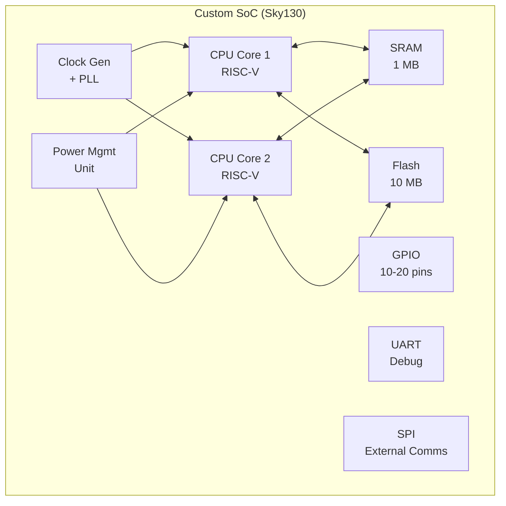
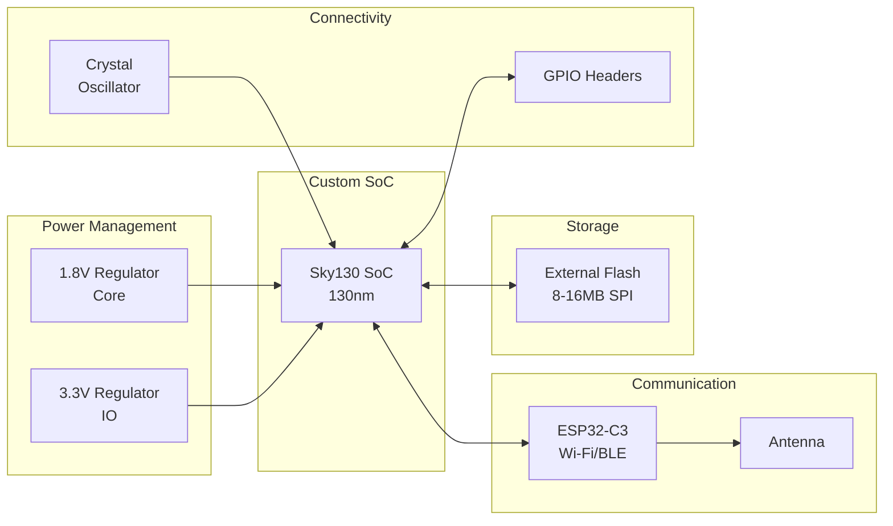

# Custom SoC/MCU Project - From Silicon to System


This project focuses on developing a custom chip (SoC/MCU) along with a complete PCB design using **Google's SkyWater 130nm open-source PDK**. The goal is to create a simple yet functional chip for embedded applications with modern communication capabilities.

## 🤝 Partnership & Technology

<div align="center">


**Manufactured in partnership with Google using SkyWater 130nm technology**

</div>

This project leverages the **SkyWater Sky130 Process Design Kit (PDK)**, an open-source 130nm process technology made available through Google's partnership with SkyWater Technology. This enables accessible silicon fabrication for open-source hardware projects.

### 🏭 Manufacturing Details
- **Process Node**: SkyWater Sky130 (130nm)
- **Technology**: CMOS
- **Voltage**: 1.8V/3.3V mixed-signal capable
- **Partner**: Google Open Source Silicon Initiative
- **Foundry**: SkyWater Technology

## 🎯 Project Objective

Design and manufacture a custom chip with a minimalist but practical design focused on computational power and implementation simplicity, utilizing the open-source SkyWater 130nm process.

## 🔧 Chip Architecture (SoC/MCU)

<div align="center">



</div>

### CPU Cores
- **2× Custom Design** - RISC-V ISA optimized for Sky130
- Focus on efficiency and 130nm process optimization
- Dual-core architecture for parallel processing

### Memory Subsystem
- **SRAM**: 1 MB (fast internal memory for program execution and data)
  - Optimized for Sky130 memory compilers
- **Flash**: 10 MB internal (if achievable with Sky130, otherwise external via SPI)

### Peripherals
- **GPIO**: 10-20 universal pins for basic inputs/outputs
- **UART**: For debug communication and bootloader (mandatory)
- **SPI**: For connecting external flash, sensors, and modules

### Support Systems
- **Clock Generator**: Basic oscillator with PLL (Sky130 analog IP)
- **Power Management Unit (PMU)**: Voltage regulation optimized for 130nm

> 💡 **Design Philosophy**: The chip is designed as a pure computational brain without complex analog components, leveraging Sky130's digital-focused capabilities.

## 🔌 PCB Board - External Components

<div align="center">



</div>

### Power Supply
- **Power Regulators**: Optimized for Sky130 voltage requirements
  - 1.8V for CPU core (Sky130 standard)
  - 3.3V for I/O peripherals
  - Low dropout regulators for clean power

### Storage
- **External SPI Flash**: 8-16 MB (backup solution for internal flash)
- Standard industry chips compatible with Sky130 I/O

### Communication Modules
- **Wi-Fi/Bluetooth/Zigbee/Thread/Matter Module**
  - ESP32-C3 as coprocessor
  - Nordic nRF52/53
  - Silicon Labs modules
- **Antenna**: Directly connected to communication module

## 📁 Project Structure

```
├── hardware/
│   ├── sky130/              # SkyWater 130nm specific files
│   │   ├── pdk/            # Process design kit files
│   │   ├── libs/           # Standard cell libraries
│   │   └── io/             # I/O pad libraries
│   ├── soc/                # Chip design (HDL files)
│   │   ├── cpu/            # RISC-V core implementation
│   │   ├── memory/         # Memory controllers (Sky130 optimized)
│   │   ├── peripherals/    # GPIO, UART, SPI modules
│   │   └── pmu/            # Power management
│   ├── pcb/                # Schematics and layout
│   │   ├── schematics/     # Circuit diagrams
│   │   ├── layout/         # PCB layout files
│   │   └── bom/            # Bill of materials
│   └── simulation/         # Testbenches and verification
├── software/
│   ├── bootloader/         # Custom bootloader
│   ├── drivers/            # Hardware abstraction layer
│   ├── examples/           # Sample applications
│   └── tools/              # Development utilities
├── fabrication/
│   ├── gds/                # GDS files for Sky130
│   ├── lef/                # Layout exchange format
│   └── assembly/           # PCB assembly instructions
└── documentation/
    ├── sky130/             # SkyWater specific documentation
    ├── architecture/       # System architecture docs
    └── getting-started/    # Setup guides
```

## 🚀 Development Phases

### Phase 1: Design & Simulation ✅
- [x] CPU core architecture definition (RISC-V)
- [x] Sky130 PDK integration
- [ ] Memory subsystem design (Sky130 memory compilers)
- [ ] Peripheral interfaces implementation
- [ ] System-level simulation and verification

### Phase 2: Silicon Implementation 🔄
- [ ] RTL synthesis with Sky130 libraries
- [ ] Place & route using OpenLane flow
- [ ] Timing closure and power analysis
- [ ] DRC/LVS verification with Sky130 rules
- [ ] Tape-out preparation for SkyWater fab

### Phase 3: PCB Development
- [ ] System-level schematic design
- [ ] Component selection (Sky130 compatible)
- [ ] PCB layout and routing
- [ ] Prototype assembly and testing

### Phase 4: Software Stack
- [ ] Bootloader development
- [ ] Hardware abstraction layer
- [ ] Driver implementation
- [ ] Example applications

## 🛠️ Tools & Technologies

### Sky130 Design Flow
- **PDK**: SkyWater Sky130 Open Source PDK
- **Design Flow**: OpenLane (Google's open-source ASIC flow)
- **Synthesis**: Yosys + ABC
- **Place & Route**: OpenROAD
- **Verification**: Magic (DRC/LVS), Netgen, XSchem

### Hardware Design
- **HDL**: Verilog/SystemVerilog (Sky130 compatible)
- **Simulation**: Icarus Verilog, Verilator
- **PCB Design**: KiCad

### Software Development
- **Toolchain**: GCC RISC-V
- **Debugger**: OpenOCD + GDB
- **Build System**: Make/CMake

## 📊 Specifications

| Component | Specification |
|-----------|---------------|
| **Process Technology** | SkyWater Sky130 (130nm CMOS) |
| **CPU Cores** | 2× Custom RISC-V |
| **SRAM** | 1 MB (Sky130 memory compiler) |
| **Flash** | 10 MB (internal/external) |
| **GPIO** | 10-20 pins |
| **Communication** | UART, SPI |
| **Core Voltage** | 1.8V (Sky130 standard) |
| **IO Voltage** | 3.3V |
| **Package** | QFN64/QFN48 (TBD) |
| **Die Size** | ~2-3 mm² (estimated) |

## 🏭 Manufacturing Partnership

<div align="center">


</div>

This project is part of **Google's Open Source Silicon Initiative**, which provides:

- 🆓 **Free access** to SkyWater 130nm PDK
- 🏭 **Shuttle runs** for prototype fabrication
- 📚 **Comprehensive documentation** and design resources
- 🛠️ **Open-source toolchain** (OpenLane, OpenROAD)

### SkyWater Sky130 Advantages
- **Mature Process**: Proven 130nm technology
- **Mixed Signal**: Support for analog and digital designs
- **Open Source**: Full PDK available on GitHub
- **Cost Effective**: Accessible for educational/research projects

## 🤝 Contributing

This is an open hardware project following Google's open-source silicon methodology. Contributions welcome in:

- RTL design and verification
- Sky130 PDK optimization
- PCB design improvements
- Software drivers and examples
- Documentation and tutorials

## 📄 License

This project is licensed under **Apache 2.0** - see the LICENSE file for details.
SkyWater PDK components are licensed under their respective open-source licenses.

## 📞 Contact

- **Author**: Prokop Šafránek
- **GitHub**: [@prokopsafranek](https://github.com/prokopsafranek)
- **Project Repository**: [prokopsafranek/chip](https://github.com/prokopsafranek/chip)

## 🔗 Resources

- [SkyWater Sky130 PDK](https://github.com/google/skywater-pdk)
- [OpenLane Design Flow](https://github.com/The-OpenROAD-Project/OpenLane)
- [Google Open Source Silicon](https://developers.google.com/silicon)
- [RISC-V International](https://riscv.org/)

---

<div align="center">


**Built with ❤️ using Google's open-source silicon ecosystem**

</div>

> ⚠️ **Note**: This project is currently in development phase. Silicon fabrication is planned through Google's shuttle program with SkyWater Technology.
